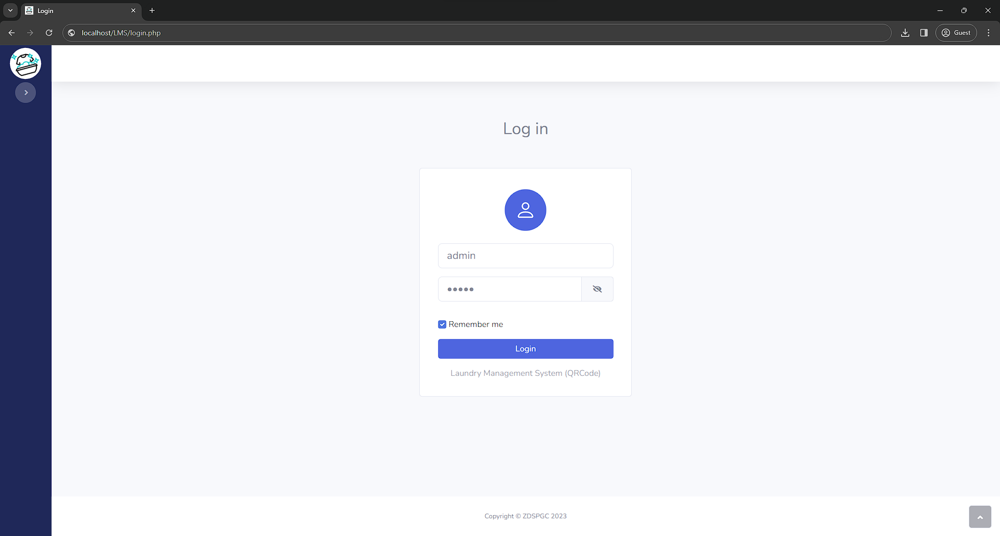
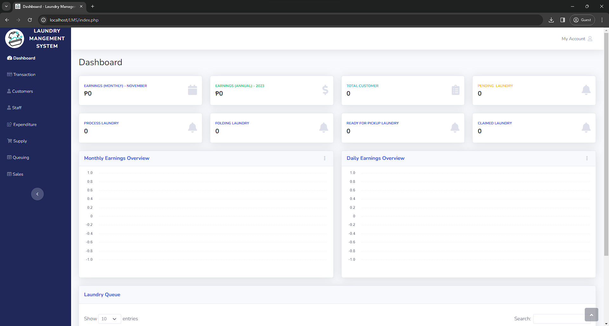
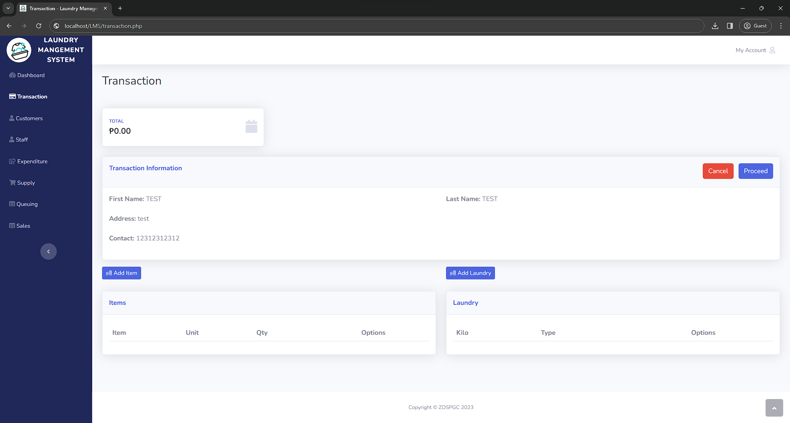

# LMS - Laundry Management System with QRCode
LMS - Laundry Management System with QRCode (Web Application)

## XAMPP System Specifications

| Tool            | Version                             |
|-----------------|-------------------------------------|
| Database Server | 10.4.28-MariaDB - mariadb.org binary distribution |
| Web Server      | Apache/2.4.56 (Win64) OpenSSL/1.1.1t PHP/8.2.4 |
| Database Client | libmysql - mysqlnd 8.2.4             |
| PHP             | 8.2.4                               |
| phpMyAdmin      | 5.2.1 (up to date)                   |

## Administrator Username & Password
```
Username: admin
Password: admin
```





# SD-3101 [LMS - Laundry Management System with QRCode]

## Table of Contents
- [Introduction](#introduction)
- [Project Overview](#project-overview)
- [Objectives](#objectives)
- [Features](#features)
- [Technologies Used](#technologies-used)
- [Setup and Installation](#setup-and-installation)
- [Usage Instructions](#usage-instructions)
- [Project Structure](#project-structure)
- [Contributors](#contributors)
- [Chagelog](#changelog)
- [Acknowledgments](#acknowledgments)
- [License](#license)

---

# Introduction
The Laundry Management System (LMS) simplifies the laundry process using QR codes for efficient tracking and management.

## Project Overview
This project targets users needing efficient laundry management, providing a streamlined solution with QR code integration to track orders and enhance user experience.

## Objectives
Develop a user-friendly solution for laundry management.
Implement QR code features for order tracking.
Validate system performance and usability.

## Features
Order Tracking: QR code scanning for real-time updates.
User Management: Admin and customer interfaces.
Payment Processing: Integration for seamless transactions.


## Technologies Used
Programming Languages: PHP
Frameworks/Libraries: None specified
Databases: MariaDB
Other Tools: XAMPP, Git


## Setup and Installation
Clone the repository:
bash
git clone https://github.com/your-repo-url.git
Install dependencies: Follow your setup tool instructions (e.g., XAMPP).
Configure environment variables: Create and edit the .env file as needed.
Run the project: Access via localhost in your browser.
Note: Ensure XAMPP and MySQL are installed.

## Usage Instructions
Access the application via http://localhost/LMS. Use the admin credentials to log in and manage laundry orders.


## Project Structure
```bash
.
├── assets/
├── functions/
├── screenshots/
├── src/
│   ├── components/
│   ├── pages/
│   └── utils/
├── 404.php
├── customer.php
├── expenditure.php
├── index.php
├── invoice.php
├── LEARN.md
├── LICENSE
├── login.php
├── logs.php
├── profile.php
├── profile-customer.php
├── profile.staff
├── queue.php
├── README.md
├── receipt.php
├── sales.php
├── staff.php
├── supply.php
├── todo.txt
├── tracking.php
└── transaction.php
```
## Contributors
[Harold Jhon Degala]: Lead Developer
[Marife Panugan]: Frontend Developer
Gerald Villaran: Project Manager
Project Timeline
Weeks 1-2: Research and planning
Weeks 3-5: Design
Weeks 6-10: Implementation
Weeks 11-12: Testing
Weeks 13-14: Documentation

## Project Timeline

Outline the project timeline, including milestones or deliverables. Example:

- **Week 1-2**: Collaborative Brainstorming for Feature Development
  - mm/dd/year
  - Meeting Recording: url
  - Proposes Features
    1.
    2.
    3.
    4.
    5.
    6.
    7.
    8.
    9.
    10.   
- **Week 3-5**: Design and setup.
- **Week 6-10**: Implementation.
- **Week 11-12**: Testing and debugging.
- **Week 13-14**: Final presentation and documentation.

## Changelog

### [Version 1.0.0] - 2024-09-07
- Initial release of the project.
- Added basic functionality for [Feature 1], [Feature 2], and [Feature 3].

### [Version 1.1.0] - 2024-09-14
- Improved user interface for [Feature 1].
- Fixed bugs related to [Feature 2].
- Updated project documentation with setup instructions.

### [Version 1.2.0] - 2024-09-21
- Added new functionality for [Feature 4].
- Refactored codebase for better performance.
- Added unit tests for [Feature 3] and [Feature 4].


## Acknowledgments

Acknowledge any resources, mentors, or external tools that helped in completing the project.

This project was built from [LMS - Laundry Management System with QRCode](https://github.com/mhiskall282/LMS-Laundry-Management-System-with-QR_Code), created by [mhiskall282
]. You can view the original repository [here](https://github.com/mhiskall282/LMS-Laundry-Management-System-with-QR_Code).

## License

MIT License

Copyright (c) 2023 Joshua Ambalong

Permission is hereby granted, free of charge, to any person obtaining a copy
of this software and associated documentation files (the "Software"), to deal
in the Software without restriction, including without limitation the rights
to use, copy, modify, merge, publish, distribute, sublicense, and/or sell
copies of the Software, and to permit persons to whom the Software is
furnished to do so, subject to the following conditions:

The above copyright notice and this permission notice shall be included in all
copies or substantial portions of the Software.

THE SOFTWARE IS PROVIDED "AS IS", WITHOUT WARRANTY OF ANY KIND, EXPRESS OR
IMPLIED, INCLUDING BUT NOT LIMITED TO THE WARRANTIES OF MERCHANTABILITY,
FITNESS FOR A PARTICULAR PURPOSE AND NONINFRINGEMENT. IN NO EVENT SHALL THE
AUTHORS OR COPYRIGHT HOLDERS BE LIABLE FOR ANY CLAIM, DAMAGES OR OTHER
LIABILITY, WHETHER IN AN ACTION OF CONTRACT, TORT OR OTHERWISE, ARISING FROM,
OUT OF OR IN CONNECTION WITH THE SOFTWARE OR THE USE OR OTHER DEALINGS IN THE
SOFTWARE.


